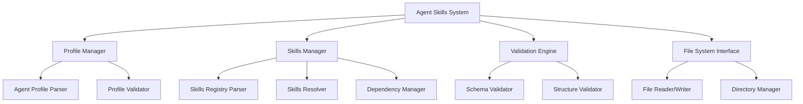

# Design Document: Agent Skills System

## Overview

The Agent Skills System provides a structured approach to managing AI agent profiles and their associated capabilities through standardized Markdown files with YAML frontmatter. The system follows progressive disclosure principles, allowing agents to load only necessary information when needed, optimizing resource usage and maintaining scalability.

The system consists of two primary components:
- **Agent Profiles** (`agent.md`): Define agent identity, personality, and configuration
- **Skills Registry** (`skills.md`): Catalog available skills with specifications and metadata

## Architecture

The system follows a modular architecture with clear separation of concerns:



### Core Components

1. **Profile Manager**: Handles agent.md file operations, parsing, and validation
2. **Skills Manager**: Manages skills.md registry, skill resolution, and associations
3. **Validation Engine**: Ensures file structure and content compliance
4. **File System Interface**: Abstracts file operations and directory management

## Components and Interfaces

### Agent Profile Structure

Agent profiles follow a standardized format with YAML frontmatter and Markdown content:

```yaml
---
name: "Agent Name"
version: "1.0.0"
description: "Brief agent description"
personality:
  traits: ["analytical", "helpful", "precise"]
  communication_style: "professional"
capabilities:
  - skill_id: "data-analysis"
    proficiency: "expert"
  - skill_id: "code-review"
    proficiency: "intermediate"
configuration:
  max_context_length: 8192
  temperature: 0.7
  response_format: "structured"
metadata:
  created: "2024-01-01T00:00:00Z"
  updated: "2024-01-01T00:00:00Z"
  author: "developer@example.com"
---

# Agent Profile: [Agent Name]

## Purpose
[Detailed description of agent's purpose and role]

## Behavioral Guidelines
[Instructions for how the agent should behave and respond]

## Domain Expertise
[Areas of specialization and knowledge domains]

## Interaction Patterns
[Preferred communication patterns and response styles]
```

### Skills Registry Structure

The skills registry maintains a catalog of available skills:

```yaml
---
registry_version: "1.0.0"
last_updated: "2024-01-01T00:00:00Z"
total_skills: 25
categories:
  - "data-processing"
  - "communication"
  - "analysis"
  - "automation"
---

# Skills Registry

## Available Skills

### Data Analysis
- **ID**: `data-analysis`
- **Category**: data-processing
- **Description**: Advanced data analysis and visualization capabilities
- **Dependencies**: ["python-runtime", "pandas", "matplotlib"]
- **Proficiency Levels**: ["beginner", "intermediate", "expert"]
- **Resources**: ["analysis-templates.md", "visualization-guide.md"]

### Code Review
- **ID**: `code-review`
- **Category**: analysis
- **Description**: Automated code review and quality assessment
- **Dependencies**: ["git-tools", "static-analysis"]
- **Proficiency Levels**: ["intermediate", "expert"]
- **Resources**: ["review-checklist.md", "best-practices.md"]
```

### Core Interfaces

```typescript
interface AgentProfile {
  metadata: AgentMetadata;
  content: AgentContent;
}

interface AgentMetadata {
  name: string;
  version: string;
  description: string;
  personality: PersonalityConfig;
  capabilities: SkillAssignment[];
  configuration: AgentConfig;
  metadata: FileMetadata;
}

interface SkillsRegistry {
  metadata: RegistryMetadata;
  skills: Skill[];
}

interface Skill {
  id: string;
  category: string;
  description: string;
  dependencies: string[];
  proficiency_levels: string[];
  resources: string[];
}
```

## Data Models

### Agent Configuration Model

```typescript
interface AgentConfig {
  max_context_length: number;
  temperature: number;
  response_format: "structured" | "conversational" | "technical";
  tools_enabled: boolean;
  memory_persistence: boolean;
}

interface PersonalityConfig {
  traits: string[];
  communication_style: "professional" | "casual" | "technical" | "friendly";
  formality_level: "high" | "medium" | "low";
  verbosity: "concise" | "detailed" | "comprehensive";
}
```

### Skills Model

```typescript
interface SkillAssignment {
  skill_id: string;
  proficiency: "beginner" | "intermediate" | "expert";
  enabled: boolean;
  custom_parameters?: Record<string, any>;
}

interface SkillDependency {
  dependency_id: string;
  version_constraint?: string;
  required: boolean;
}
```

Now I need to use the prework tool to analyze the acceptance criteria before writing the correctness properties:

<function_calls>
<invoke name="prework">
<parameter name="featureName">agent-skills-system

## Correctness Properties

*A property is a characteristic or behavior that should hold true across all valid executions of a system—essentially, a formal statement about what the system should do. Properties serve as the bridge between human-readable specifications and machine-verifiable correctness guarantees.*

After analyzing the acceptance criteria, I've identified several key properties that can be consolidated to avoid redundancy:

### Property Reflection

Many of the individual acceptance criteria can be combined into more comprehensive properties:
- File generation properties (1.1, 2.1, 5.2) can be combined into a single file generation property
- Validation properties (1.2, 2.2, 3.1, 4.1, 4.2) can be consolidated into comprehensive validation properties
- Parsing properties (1.4, 6.4) can be combined into a single parsing property
- File format properties (6.1, 6.2, 6.5) can be unified into a format compliance property

### Core Properties

**Property 1: File Generation Consistency**
*For any* agent profile or skills registry creation request, the system should generate files with all required sections, proper YAML frontmatter, and valid Markdown structure
**Validates: Requirements 1.1, 2.1, 5.2, 6.1, 6.2**

**Property 2: Validation Completeness**
*For any* agent profile or skills specification, validation should correctly identify all structural and content issues while accepting valid configurations
**Validates: Requirements 1.2, 2.2, 3.1, 4.1, 4.2**

**Property 3: Parsing Round-Trip Consistency**
*For any* valid agent.md or skills.md file, parsing then serializing should produce an equivalent file structure
**Validates: Requirements 1.4, 6.4**

**Property 4: Dependency Resolution Correctness**
*For any* skill dependency graph, the system should correctly resolve dependencies and detect circular references
**Validates: Requirements 2.5, 3.2, 3.3**

**Property 5: Search and Query Accuracy**
*For any* skills query with search criteria, all returned results should match the criteria and no matching skills should be omitted
**Validates: Requirements 2.4**

**Property 6: Profile-Skills Association Integrity**
*For any* agent profile with skill assignments, all referenced skills should be resolvable and compatible
**Validates: Requirements 3.2, 3.4**

**Property 7: Error Handling Clarity**
*For any* invalid input or malformed file, the system should provide specific, actionable error messages
**Validates: Requirements 4.3, 4.4**

**Property 8: Initialization Completeness**
*For any* initialization request, the system should create all required directories, templates, and verify proper configuration
**Validates: Requirements 5.1, 5.4**

**Property 9: Backward Compatibility Preservation**
*For any* valid file from a previous schema version, the system should successfully parse and process it
**Validates: Requirements 1.5, 4.5**

**Property 10: Metadata Support Completeness**
*For any* agent configuration, all specified metadata fields (name, description, personality, capabilities) should be properly stored and retrievable
**Validates: Requirements 1.3, 2.3**

## Error Handling

The system implements comprehensive error handling across all components:

### Validation Errors
- **Schema Violations**: Clear messages indicating which fields are missing or invalid
- **Format Errors**: Specific line numbers and character positions for parsing failures
- **Dependency Conflicts**: Detailed dependency resolution failure explanations

### File System Errors
- **Permission Issues**: Graceful handling of read/write permission problems
- **Missing Files**: Clear indication of which files are missing and how to resolve
- **Corruption Detection**: Validation of file integrity and recovery suggestions

### Runtime Errors
- **Memory Constraints**: Efficient handling of large skill registries and agent profiles
- **Circular Dependencies**: Detection and prevention with clear error reporting
- **Version Conflicts**: Backward compatibility handling with migration guidance

### Error Recovery Strategies
1. **Graceful Degradation**: System continues operating with reduced functionality when possible
2. **Automatic Repair**: Self-healing for common file format issues
3. **User Guidance**: Actionable error messages with suggested fixes
4. **Rollback Support**: Ability to revert to previous working configurations

## Testing Strategy

The system employs a dual testing approach combining unit tests for specific scenarios and property-based tests for comprehensive coverage:

### Unit Testing
- **File Generation**: Verify template creation with expected content and structure
- **Validation Logic**: Test specific validation rules with known valid/invalid inputs
- **Error Scenarios**: Ensure proper error handling for edge cases
- **Integration Points**: Test component interactions and data flow

### Property-Based Testing
- **Minimum 100 iterations** per property test to ensure comprehensive coverage
- **Random Input Generation**: Create diverse agent profiles and skills for testing
- **Invariant Verification**: Ensure system properties hold across all inputs
- **Regression Prevention**: Catch edge cases that unit tests might miss

### Testing Framework
The system will use **Hypothesis** (Python) or **fast-check** (TypeScript) for property-based testing, depending on implementation language choice.

### Test Configuration
Each property test will be tagged with:
**Feature: agent-skills-system, Property {number}: {property_text}**

Example test structure:
```python
@given(agent_profiles())
def test_file_generation_consistency(profile):
    """Feature: agent-skills-system, Property 1: File Generation Consistency"""
    generated_file = system.create_agent_profile(profile)
    assert has_required_sections(generated_file)
    assert has_valid_yaml_frontmatter(generated_file)
    assert is_valid_markdown(generated_file)
```

### Coverage Goals
- **100% property coverage**: Every correctness property implemented as a test
- **Edge case coverage**: Unit tests for boundary conditions and error scenarios
- **Integration coverage**: End-to-end workflows from initialization to skill resolution
- **Performance validation**: Ensure system scales with large skill registries and agent profiles