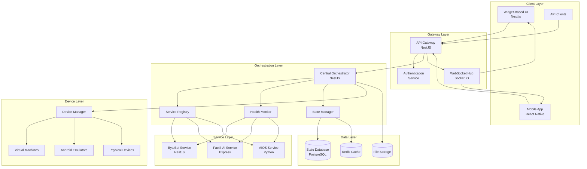

# Design Document: Unified Application Framework

## Overview

The Unified Application Framework provides a centralized orchestration system that integrates ByteBot (NestJS), Factif-AI (Express), and AIOS (Python) into a cohesive platform. The architecture follows microservices patterns with an API Gateway, real-time communication hub, and widget-based user interface for managing virtual machines, Android emulators, physical devices, and all associated services.

The system is designed around the principle of service autonomy while providing unified control, ensuring each service maintains its core functionality while participating in the larger ecosystem.

## Architecture

The framework follows a hub-and-spoke architecture with the central orchestrator managing all service interactions:



### Core Components

1. **Central Orchestrator**: NestJS-based service that coordinates all operations
2. **API Gateway**: Routes and manages all external requests
3. **WebSocket Hub**: Handles real-time communication across all services
4. **Service Registry**: Maintains service discovery and health information
5. **Device Manager**: Controls VMs, emulators, and physical devices
6. **Widget System**: Modular UI components for service interaction

## Components and Interfaces

### Central Orchestrator

The orchestrator serves as the main coordination point for all services:

```typescript
interface OrchestratorService {
  // Service Management
  registerService(service: ServiceNode): Promise<void>;
  unregisterService(serviceId: string): Promise<void>;
  getServiceHealth(serviceId: string): Promise<HealthStatus>;
  
  // Device Management
  provisionDevice(request: DeviceRequest): Promise<Device>;
  releaseDevice(deviceId: string): Promise<void>;
  getDeviceStatus(deviceId: string): Promise<DeviceStatus>;
  
  // State Management
  getGlobalState(): Promise<GlobalState>;
  updateState(update: StateUpdate): Promise<void>;
  subscribeToStateChanges(callback: StateChangeCallback): void;
}

interface ServiceNode {
  id: string;
  name: string;
  type: 'nestjs' | 'express' | 'python';
  endpoint: string;
  healthEndpoint: string;
  capabilities: string[];
  metadata: Record<string, any>;
}
```

### API Gateway

The gateway handles all external communication and routing:

```typescript
interface APIGateway {
  // Request Routing
  route(request: IncomingRequest): Promise<ServiceResponse>;
  registerRoute(pattern: string, serviceId: string): void;
  
  // Authentication & Authorization
  authenticate(token: string): Promise<User>;
  authorize(user: User, resource: string, action: string): Promise<boolean>;
  
  // Rate Limiting
  checkRateLimit(clientId: string, endpoint: string): Promise<boolean>;
  
  // Protocol Translation
  translateRequest(request: any, targetProtocol: Protocol): any;
  translateResponse(response: any, sourceProtocol: Protocol): any;
}

interface IncomingRequest {
  method: string;
  path: string;
  headers: Record<string, string>;
  body: any;
  clientId: string;
}
```

### Device Manager

Manages all types of devices and their lifecycle:

```typescript
interface DeviceManager {
  // Virtual Machine Management
  createVM(config: VMConfig): Promise<VirtualMachine>;
  startVM(vmId: string): Promise<void>;
  stopVM(vmId: string): Promise<void>;
  deleteVM(vmId: string): Promise<void>;
  
  // Android Emulator Management
  createEmulator(config: EmulatorConfig): Promise<AndroidEmulator>;
  startEmulator(emulatorId: string): Promise<void>;
  stopEmulator(emulatorId: string): Promise<void>;
  
  // Physical Device Management
  discoverDevices(): Promise<PhysicalDevice[]>;
  connectDevice(deviceId: string): Promise<void>;
  disconnectDevice(deviceId: string): Promise<void>;
  
  // Resource Management
  getResourceUsage(): Promise<ResourceUsage>;
  allocateResources(request: ResourceRequest): Promise<ResourceAllocation>;
}

interface VMConfig {
  name: string;
  os: string;
  memory: number;
  cpu: number;
  storage: number;
  network: NetworkConfig;
}
```

### WebSocket Hub

Handles real-time communication across all services:

```typescript
interface WebSocketHub {
  // Connection Management
  handleConnection(socket: Socket): void;
  handleDisconnection(socketId: string): void;
  
  // Event Broadcasting
  broadcast(event: string, data: any): void;
  broadcastToRoom(room: string, event: string, data: any): void;
  sendToClient(clientId: string, event: string, data: any): void;
  
  // Room Management
  joinRoom(socketId: string, room: string): void;
  leaveRoom(socketId: string, room: string): void;
  
  // Event Filtering
  subscribeToEvents(socketId: string, filters: EventFilter[]): void;
  unsubscribeFromEvents(socketId: string, filters: EventFilter[]): void;
}

interface EventFilter {
  service?: string;
  eventType?: string;
  priority?: 'low' | 'medium' | 'high' | 'critical';
}
```

## Data Models

### Service Registry Schema

```typescript
interface ServiceRegistryEntry {
  id: string;
  name: string;
  type: ServiceType;
  status: ServiceStatus;
  endpoint: string;
  healthEndpoint: string;
  lastHeartbeat: Date;
  capabilities: Capability[];
  metadata: ServiceMetadata;
  version: string;
  dependencies: string[];
}

interface Capability {
  name: string;
  version: string;
  description: string;
  endpoints: CapabilityEndpoint[];
}

interface CapabilityEndpoint {
  method: string;
  path: string;
  description: string;
  parameters: Parameter[];
  responses: Response[];
}
```

### Device Registry Schema

```typescript
interface Device {
  id: string;
  name: string;
  type: DeviceType;
  status: DeviceStatus;
  specifications: DeviceSpecs;
  location: string;
  assignedTo?: string;
  createdAt: Date;
  lastActivity: Date;
}

interface DeviceSpecs {
  cpu?: CPUSpecs;
  memory?: MemorySpecs;
  storage?: StorageSpecs;
  network?: NetworkSpecs;
  os?: OSSpecs;
}

interface ResourceAllocation {
  deviceId: string;
  allocatedResources: AllocatedResource[];
  expiresAt: Date;
  priority: number;
}
```

### Global State Schema

```typescript
interface GlobalState {
  services: Record<string, ServiceState>;
  devices: Record<string, DeviceState>;
  users: Record<string, UserSession>;
  system: SystemState;
  timestamp: Date;
}

interface ServiceState {
  id: string;
  status: 'running' | 'stopped' | 'error' | 'maintenance';
  metrics: ServiceMetrics;
  configuration: Record<string, any>;
  lastUpdate: Date;
}

interface SystemState {
  totalServices: number;
  activeServices: number;
  totalDevices: number;
  activeDevices: number;
  systemLoad: number;
  memoryUsage: number;
  diskUsage: number;
}
```

## User Interface Design

### Workflow-Based Dashboard Interface

The UI follows a sophisticated workflow automation interface design with the following key characteristics:

#### Design System

**Color Scheme:**
- Primary Background: Dark theme (#1a1a1a, #2a2a2a)
- Accent Colors: Teal/Green (#00d4aa) for primary actions and branding
- Status Colors: Blue (#4a9eff) for active states, Red (#ff4757) for errors
- Text: White/Light gray for primary text, muted gray for secondary
- Cards: Dark gray (#2d2d2d) with subtle borders

**Typography:**
- Clean, modern sans-serif font
- Clear hierarchy with varying font weights
- Readable sizing for workflow titles and descriptions

#### Layout Structure

**Three-Panel Layout:**
1. **Left Sidebar Navigation** (200px width)
   - Collapsible task/workflow browser
   - Hierarchical organization with categories
   - Search functionality at top
   - User profile section at bottom

2. **Main Content Area** (Flexible width)
   - Grid-based workflow cards (3-4 columns responsive)
   - Each card shows: title, description, creation date, status, run button
   - Top header with search, create button, and breadcrumbs

3. **Right Panel/Modal Overlays** (400-600px width)
   - Detailed workflow execution views
   - Real-time progress tracking
   - Chat/conversation interface for AI interactions
   - Settings and configuration panels

#### Widget Types and Components

**Workflow Cards:**
```typescript
interface WorkflowCard {
  id: string;
  title: string;
  description: string;
  status: 'idle' | 'running' | 'completed' | 'failed';
  createdDate: string;
  icon: string;
  category: string;
  runButton: boolean;
  progressBar?: number;
}
```

**Execution Interface:**
- Real-time progress bars with percentage completion
- Chat-style AI interaction with message bubbles
- Screen recording/screenshot display areas
- Action buttons (Run, Stop, Settings, etc.)
- Status indicators with color coding

**Navigation Components:**
- Expandable/collapsible sidebar sections
- Breadcrumb navigation
- Search with autocomplete
- Category filters and tags

#### Interactive Elements

**Workflow Management:**
- Drag-and-drop workflow organization
- Quick action buttons (Run, Edit, Delete, Share)
- Bulk operations for multiple workflows
- Real-time status updates

**AI Chat Interface:**
- Conversational UI with message history
- File upload and media display
- Progress indicators for long-running tasks
- Error handling with retry options

**Device Control Widgets:**
- Floating action buttons for device selection
- Status overlays showing device states
- Quick access toolbar for common actions
- Notification system for device events

#### Responsive Design

**Desktop (1200px+):**
- Full three-panel layout
- Grid view with 3-4 workflow cards per row
- Expanded sidebar with full navigation

**Tablet (768px - 1199px):**
- Collapsible sidebar
- 2-3 workflow cards per row
- Overlay panels for detailed views

**Mobile (< 768px):**
- Single column layout
- Bottom navigation bar
- Full-screen modals for workflow execution
- Swipe gestures for navigation

#### Accessibility Features

- High contrast mode support
- Keyboard navigation for all interactive elements
- Screen reader compatibility with ARIA labels
- Focus indicators and skip links
- Reduced motion options for animations

### Widget System Architecture

The interface is built around workflow cards and execution panels rather than traditional widgets:

```typescript
interface WorkflowWidget {
  id: string;
  type: 'workflow-card' | 'execution-panel' | 'device-control' | 'chat-interface';
  title: string;
  position: LayoutPosition;
  configuration: WorkflowConfig;
  permissions: Permission[];
  status: WorkflowStatus;
}

interface WorkflowConfig {
  serviceId?: string;
  refreshInterval?: number;
  autoRun?: boolean;
  displayOptions?: {
    showProgress: boolean;
    showLogs: boolean;
    compactView: boolean;
  };
}

interface ExecutionPanel {
  workflowId: string;
  status: 'idle' | 'running' | 'completed' | 'failed';
  progress: number;
  logs: LogEntry[];
  chatHistory: ChatMessage[];
  screenRecording?: MediaFile;
}

interface DeviceControlWidget {
  deviceId: string;
  deviceType: 'vm' | 'emulator' | 'physical';
  status: DeviceStatus;
  quickActions: QuickAction[];
  resourceUsage: ResourceMetrics;
}
```

#### Component Hierarchy

**Main Dashboard:**
- WorkflowGrid (displays workflow cards)
- NavigationSidebar (collapsible navigation)
- TopHeader (search, create, user menu)
- NotificationSystem (real-time alerts)

**Execution Interface:**
- ExecutionPanel (main workflow runner)
- ChatInterface (AI conversation)
- ProgressTracker (real-time updates)
- MediaViewer (screenshots, recordings)

**Device Management:**
- DeviceGrid (available devices)
- DeviceControlPanel (individual device control)
- ResourceMonitor (system metrics)
- QuickActions (common device operations)

## Error Handling

### Service Communication Errors

- **Circuit Breaker Pattern**: Prevent cascading failures between services
- **Retry Logic**: Exponential backoff for transient failures
- **Fallback Mechanisms**: Graceful degradation when services are unavailable
- **Error Aggregation**: Centralized error logging and monitoring

### Device Management Errors

- **Resource Conflicts**: Automatic conflict resolution and resource reallocation
- **Device Failures**: Health monitoring with automatic recovery attempts
- **Network Issues**: Connection pooling and automatic reconnection
- **Capacity Limits**: Queue management and resource scheduling

### Real-Time Communication Errors

- **Connection Drops**: Automatic reconnection with state synchronization
- **Message Loss**: Message acknowledgment and retry mechanisms
- **Backpressure**: Flow control and message prioritization
- **Scaling Issues**: Load balancing and connection distribution

## Correctness Properties

*A property is a characteristic or behavior that should hold true across all valid executions of a system—essentially, a formal statement about what the system should do. Properties serve as the bridge between human-readable specifications and machine-verifiable correctness guarantees.*

### Real-Time Event Validation and Delivery Properties

**Property 44: Event Schema Validation**
*For any* event published to the Real_Time_Hub, the event must pass schema validation before being broadcast to subscribers
**Validates: Requirements 9.1**

**Property 45: Event Delivery Order Preservation**
*For any* sequence of events published to a single event stream, subscribers must receive the events in the exact same order they were published
**Validates: Requirements 9.2**

**Property 46: Event Buffering During Disconnection**
*For any* set of events published while a client is disconnected, all events must be delivered to that client upon successful reconnection
**Validates: Requirements 9.3**

**Property 47: Critical Event Acknowledgment**
*For any* event marked as critical, the Real_Time_Hub must receive an acknowledgment from the subscriber before considering delivery complete
**Validates: Requirements 9.4**

**Property 48: Event Delivery Retry with Exponential Backoff**
*For any* event that fails delivery, the Real_Time_Hub must retry delivery with exponential backoff, attempting a maximum of 5 times before marking as failed
**Validates: Requirements 9.5**

### WebSocket Connection Management Properties

**Property 49: Automatic Reconnection with Backoff**
*For any* connection drop, the Real_Time_Hub must automatically attempt reconnection using exponential backoff strategy
**Validates: Requirements 10.1**

**Property 50: Heartbeat Interval Consistency**
*For any* active WebSocket connection, the Real_Time_Hub must send heartbeat messages at 10-second intervals (±1 second tolerance)
**Validates: Requirements 10.2**

**Property 51: Subscription Restoration After Reconnection**
*For any* client that reconnects after disconnection, all previous subscriptions must be automatically restored without client intervention
**Validates: Requirements 10.3**

**Property 52: Concurrent Connection Limit Enforcement**
*For any* client attempting to create multiple connections, the Real_Time_Hub must enforce the maximum concurrent connection limit per client
**Validates: Requirements 10.4**

**Property 53: Connection State Change Notifications**
*For any* connection state transition (connecting, connected, disconnected, error), the Real_Time_Hub must notify the client of the new state
**Validates: Requirements 10.5**

### Performance and Latency Properties

**Property 54: Event Delivery Latency Under Normal Load**
*For any* event published under normal system load (< 80% capacity), the event must be delivered to all subscribed clients within 100 milliseconds
**Validates: Requirements 11.1**

**Property 55: UI Rendering Frame Rate**
*For any* UI update in the Widget_System, the rendering must maintain 60 frames per second without frame drops during normal operation
**Validates: Requirements 11.2**

**Property 56: Health Check Response Time**
*For any* health check request to the API_Gateway, the response must be returned within 50 milliseconds under normal load
**Validates: Requirements 11.4**

### Accessibility Compliance Properties

**Property 57: WCAG 2.1 AA Compliance**
*For any* UI component in the Widget_System, automated accessibility testing must pass WCAG 2.1 Level AA standards
**Validates: Requirements 12.1**

**Property 58: Keyboard Navigation Focus Indicators**
*For any* interactive element in the Widget_System, keyboard navigation must display a visible focus indicator that meets WCAG contrast requirements
**Validates: Requirements 12.2**

**Property 59: ARIA Labels and Roles Completeness**
*For any* UI component in the Widget_System, appropriate ARIA labels and roles must be present and semantically correct
**Validates: Requirements 12.3**

**Property 60: Dynamic Content Announcements**
*For any* dynamic content update in the Widget_System, screen readers must receive appropriate ARIA live region announcements
**Validates: Requirements 12.4**

**Property 61: High Contrast Mode Support**
*For any* UI state in the Widget_System, enabling high contrast mode must result in all text and interactive elements meeting WCAG contrast ratios
**Validates: Requirements 12.5**

### Widget System API and Lifecycle Properties

**Property 62: Widget Metadata Validation**
*For any* widget registration attempt, the Widget_System must validate widget metadata against the defined schema and reject invalid registrations
**Validates: Requirements 13.1**

**Property 63: Widget Lifecycle Hook Invocation**
*For any* widget, the Widget_System must invoke lifecycle hooks (initialization, update, cleanup) in the correct order at appropriate times
**Validates: Requirements 13.2**

**Property 64: Inter-Widget Message Delivery**
*For any* message sent from one widget to another through the message bus, the message must be delivered to the target widget without modification
**Validates: Requirements 13.3**

**Property 65: Widget State Isolation**
*For any* two widgets, modifying state in one widget must not affect the state of any other widget
**Validates: Requirements 13.4**

**Property 66: Widget Resource Cleanup**
*For any* widget removal, the Widget_System must clean up all associated resources, subscriptions, and event listeners within 1 second
**Validates: Requirements 13.5**

## Testing Strategy

### Integration Testing

- **Service Integration**: End-to-end testing of service communication
- **Device Integration**: Testing device provisioning and management
- **UI Integration**: Widget interaction and real-time updates
- **Performance Testing**: Load testing and scalability validation

### Unit Testing

- **Service Components**: Individual service functionality
- **API Gateway**: Routing and protocol translation
- **Device Manager**: Device lifecycle operations
- **Widget System**: Component rendering and interaction

### Property-Based Testing

The system will use **fast-check** for TypeScript components and **Hypothesis** for any Python integration components.

Test configuration will include:
- **Minimum 100 iterations** per property test
- **Service Communication Properties**: Message delivery and ordering
- **State Consistency Properties**: Global state synchronization
- **Device Management Properties**: Resource allocation and cleanup
- **UI Properties**: Widget state management and persistence
- **Real-Time Event Properties**: Event validation, delivery order, buffering, acknowledgment, and retry logic
- **WebSocket Connection Properties**: Auto-reconnection, heartbeat monitoring, subscription restoration, connection limits
- **Performance Properties**: Event delivery latency, UI frame rate, health check response times
- **Accessibility Properties**: WCAG compliance, keyboard navigation, ARIA attributes, screen reader support
- **Widget Lifecycle Properties**: Metadata validation, lifecycle hooks, message bus, state isolation, resource cleanup

Each property test will be tagged with:
**Feature: unified-app-framework, Property {number}: {property_text}**

### Real-Time Integration Testing

**WebSocket Connection Testing**:
- Test automatic reconnection with simulated network failures
- Verify heartbeat mechanism maintains connection health
- Test subscription restoration after reconnection
- Validate connection limit enforcement

**Event Delivery Testing**:
- Test event schema validation with valid and invalid events
- Verify event ordering within streams
- Test event buffering during disconnections
- Validate critical event acknowledgment
- Test retry logic with exponential backoff

**Performance Testing**:
- Measure event delivery latency under various load conditions
- Test UI rendering performance with rapid updates
- Validate health check response times
- Test system behavior under high load (1000+ concurrent connections)
- Verify backpressure mechanisms activate appropriately

**Accessibility Testing**:
- Run automated WCAG 2.1 AA compliance tests using axe-core or similar tools
- Test keyboard navigation across all interactive elements
- Verify ARIA labels and roles using accessibility tree inspection
- Test screen reader announcements with assistive technology simulators
- Validate high contrast mode and color preference support

**Widget System Testing**:
- Test widget registration with valid and invalid metadata
- Verify lifecycle hook invocation order and timing
- Test inter-widget communication through message bus
- Validate widget state isolation
- Test resource cleanup on widget removal

### End-to-End Workflow Testing

**Complete User Workflows**:
- Test workflow creation from UI through API Gateway to services
- Verify real-time updates flow from backend to UI via WebSocket
- Test device provisioning workflows from UI to device manager
- Validate multi-service workflows spanning ByteBot, Factif-AI, and AIOS
- Test error handling and recovery across the entire stack

**Browser Automation Testing**:
- Use Playwright or Cypress for E2E UI testing
- Test real-time UI updates with WebSocket events
- Verify accessibility features in real browser environments
- Test responsive design across different viewport sizes
- Validate widget drag-and-drop functionality