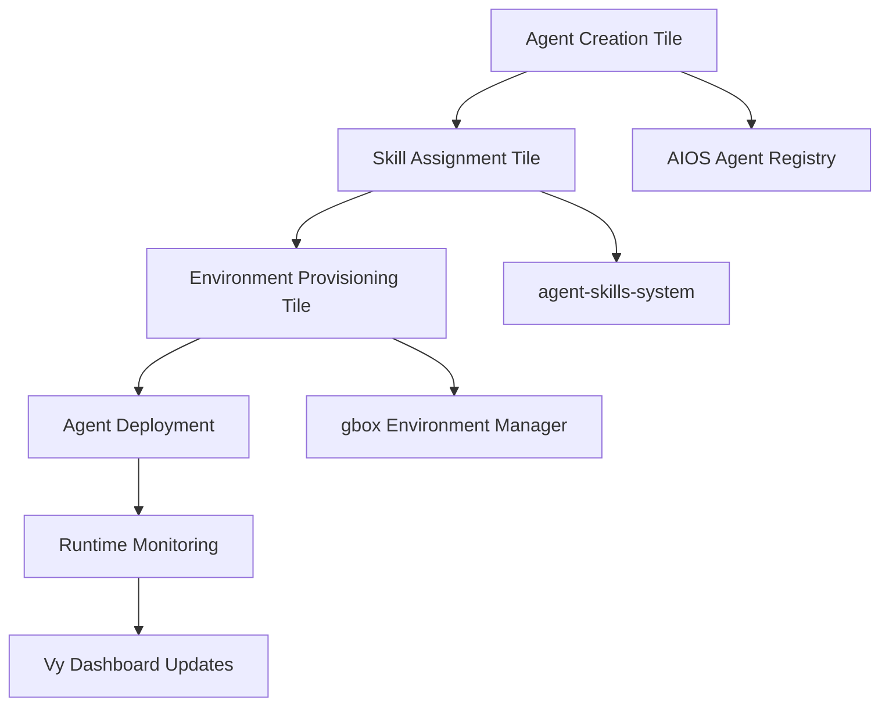

# Vy Workflows Tab Integration Design

## Overview

This document specifies how AIOS, gbox, and agent-skills-system integrate into the Vy workflows tab of the unified orchestration interface. The design provides workflow tiles for agent lifecycle management with run controls and scheduling capabilities.

## Architecture Integration

### System Components

- **AIOS**: Provides AI inference engine and agent orchestration
- **gbox**: Manages Android/Linux environments for agent execution
- **agent-skills-system**: Handles agent profiles and skill management via Markdown files
- **Vy Interface**: Unified dashboard with workflow tiles and real-time monitoring

### Integration Flow



## Workflow Tiles Specification

### 1. Agent Creation Tile

**Purpose**: Create new AI agents using agent-skills-system with AIOS integration.

**Visual Design**:
```typescript
interface AgentCreationTile extends WorkflowCard {
  container: {
    background: 'var(--bg-card)';
    border: '1px solid var(--border-color)';
    borderRadius: '12px';
    padding: '20px';
    minHeight: '280px';
  };

  header: {
    icon: '🤖'; // Agent icon
    title: 'Create Agent';
    statusBadge: StatusBadge;
  };

  form: {
    nameField: TextInput;
    personalitySelector: PersonalityDropdown;
    capabilitiesGrid: CapabilitySelector;
    templateSelector: AgentTemplateDropdown;
  };

  actions: {
    createButton: PrimaryButton;
    scheduleButton: SecondaryButton;
    previewButton: GhostButton;
  };
}
```

**Integration Points**:
- **agent-skills-system**: Creates Markdown profile files with YAML frontmatter
- **AIOS**: Registers agent in AI inference engine with personality traits
- **Vy**: Real-time progress updates and validation feedback

**Run Controls**:
```typescript
interface AgentCreationControls {
  execute: {
    label: 'Create Agent';
    action: 'createAgent';
    parameters: CreateAgentParams;
    validation: ZodSchema;
  };

  schedule: {
    cronExpression: string;
    timezone: string;
    enabled: boolean;
  };

  status: {
    idle: 'Ready to create';
    running: 'Creating agent profile...';
    success: 'Agent created successfully';
    error: 'Creation failed';
  };
}
```

**API Integration**:
```typescript
// Agent creation workflow
POST /api/workflows/agent-creation
{
  "agentSpec": {
    "name": "WebDev Agent",
    "personality": {
      "communicationStyle": "technical",
      "decisionMaking": "analytical"
    },
    "capabilities": ["javascript", "react", "web-development"],
    "template": "frontend-specialist"
  },
  "schedule": {
    "cron": "0 9 * * 1", // Weekly on Monday
    "enabled": false
  }
}
```

### 2. Environment Management Tile

**Purpose**: Provision and manage execution environments using gbox for agent deployment.

**Visual Design**:
```typescript
interface EnvironmentManagementTile extends WorkflowCard {
  container: {
    background: 'var(--bg-card)';
    border: '1px solid var(--border-color)';
    borderRadius: '12px';
    padding: '20px';
    minHeight: '320px';
  };

  header: {
    icon: '📱'; // Environment icon
    title: 'Environment Manager';
    statusBadge: StatusBadge;
  };

  environmentGrid: {
    androidDevices: DeviceCard[];
    linuxDesktops: DeviceCard[];
    browserInstances: BrowserCard[];
  };

  controls: {
    provisionButton: PrimaryButton;
    connectButton: SecondaryButton;
    terminateButton: DangerButton;
  };

  metrics: {
    activeEnvironments: number;
    totalCapacity: number;
    utilizationPercent: number;
  };
}
```

**Integration Points**:
- **gbox**: Environment provisioning and device management
- **AIOS**: Environment capability detection for agent compatibility
- **Vy**: Real-time environment status and resource monitoring

**Run Controls**:
```typescript
interface EnvironmentControls {
  provision: {
    type: 'android' | 'linux-desktop' | 'browser';
    specs: EnvironmentSpecs;
    autoTerminate: boolean;
    timeout: number;
  };

  schedule: {
    maintenance: CronSchedule;
    scaling: AutoScalingRules;
    cleanup: RetentionPolicy;
  };

  monitoring: {
    healthChecks: HealthCheckConfig;
    metrics: MetricsCollection;
    alerts: AlertRules;
  };
}
```

**API Integration**:
```typescript
// Environment provisioning
POST /api/workflows/environment-provision
{
  "environmentType": "android",
  "specs": {
    "device": "pixel-6",
    "os": "android-13",
    "resources": {
      "cpu": 2,
      "memory": "4GB",
      "storage": "32GB"
    }
  },
  "schedule": {
    "autoTerminate": true,
    "maxRuntime": "2h"
  }
}
```

### 3. Skill Assignment Tile

**Purpose**: Assign skills from agent-skills-system to agents and deploy configurations.

**Visual Design**:
```typescript
interface SkillAssignmentTile extends WorkflowCard {
  container: {
    background: 'var(--bg-card)';
    border: '1px solid var(--border-color)';
    borderRadius: '12px';
    padding: '20px';
    minHeight: '360px';
  };

  header: {
    icon: '⚡'; // Skills icon
    title: 'Skill Assignment';
    statusBadge: StatusBadge;
  };

  agentSelector: {
    availableAgents: AgentProfile[];
    selectedAgent: AgentProfile | null;
  };

  skillBrowser: {
    categories: SkillCategory[];
    skills: Skill[];
    searchFilter: string;
    proficiencyFilter: ProficiencyLevel;
  };

  assignmentPanel: {
    assignedSkills: AssignedSkill[];
    proficiencyLevels: ProficiencySlider[];
    compatibilityWarnings: Warning[];
  };

  deploymentControls: {
    assignButton: PrimaryButton;
    deployButton: SecondaryButton;
    validateButton: GhostButton;
  };
}
```

**Integration Points**:
- **agent-skills-system**: Skill registry, dependency resolution, and assignment logic
- **AIOS**: Agent capability updates and skill loading
- **gbox**: Environment-specific skill deployment
- **Vy**: Dependency visualization and compatibility checking

**Run Controls**:
```typescript
interface SkillAssignmentControls {
  assign: {
    agentId: string;
    skillIds: string[];
    proficiencyLevels: Record<string, number>;
    forceAssignment: boolean;
  };

  validate: {
    compatibilityCheck: boolean;
    dependencyResolution: boolean;
    environmentCompatibility: boolean;
  };

  deploy: {
    targetEnvironments: string[];
    rollbackOnFailure: boolean;
    gradualRollout: boolean;
  };

  schedule: {
    retraining: CronSchedule;
    skillUpdates: AutoUpdateRules;
    proficiencyAssessment: AssessmentSchedule;
  };
}
```

**API Integration**:
```typescript
// Skill assignment workflow
POST /api/workflows/skill-assignment
{
  "agentId": "agent-webdev-001",
  "assignments": [
    {
      "skillId": "react-development",
      "proficiency": 4,
      "autoUpdate": true
    },
    {
      "skillId": "typescript-coding",
      "proficiency": 3,
      "dependencies": ["javascript-coding"]
    }
  ],
  "validation": {
    "checkCompatibility": true,
    "resolveDependencies": true
  },
  "deployment": {
    "environments": ["android-dev-001", "linux-desktop-002"],
    "rollbackOnFailure": true
  }
}
```

## Workflow Orchestration

### Tile Interdependencies

```typescript
interface WorkflowOrchestration {
  agentCreation: {
    outputs: {
      agentId: string;
      agentProfile: AgentProfile;
    };
    nextSteps: ['skill-assignment', 'environment-provisioning'];
  };

  skillAssignment: {
    inputs: {
      agentId: string; // From agent creation
    };
    outputs: {
      skillAssignments: AssignedSkill[];
      compatibilityReport: CompatibilityReport;
    };
    nextSteps: ['environment-provisioning'];
  };

  environmentProvisioning: {
    inputs: {
      agentId: string; // From agent creation
      skillAssignments: AssignedSkill[]; // From skill assignment
    };
    outputs: {
      environmentIds: string[];
      deploymentStatus: DeploymentStatus;
    };
    nextSteps: ['runtime-monitoring'];
  };
}
```

### Chained Workflow Execution

```typescript
// Complete agent deployment pipeline
POST /api/workflows/chained-deployment
{
  "pipeline": [
    {
      "tile": "agent-creation",
      "config": { /* agent creation config */ },
      "onSuccess": "skill-assignment"
    },
    {
      "tile": "skill-assignment",
      "config": { /* skill assignment config */ },
      "onSuccess": "environment-provisioning"
    },
    {
      "tile": "environment-provisioning",
      "config": { /* environment config */ },
      "onSuccess": "complete"
    }
  ],
  "rollback": {
    "enabled": true,
    "failureThreshold": 0.5
  }
}
```

## Scheduling System

### Cron-based Scheduling

```typescript
interface WorkflowSchedule {
  tileId: string;
  cronExpression: string; // Standard cron format
  timezone: string;
  enabled: boolean;
  parameters: Record<string, any>;
  retryPolicy: {
    maxRetries: number;
    backoffStrategy: 'linear' | 'exponential';
    backoffMultiplier: number;
  };
  notifications: {
    onStart: boolean;
    onSuccess: boolean;
    onFailure: boolean;
    channels: NotificationChannel[];
  };
}
```

### Advanced Scheduling Features

```typescript
interface AdvancedScheduling {
  conditionalExecution: {
    dependencies: WorkflowDependency[];
    conditions: ExecutionCondition[];
  };

  resourceAware: {
    maxConcurrency: number;
    resourceRequirements: ResourceRequirements;
    queuePriority: PriorityLevel;
  };

  eventDriven: {
    triggers: EventTrigger[];
    webhooks: WebhookConfig[];
  };
}
```

## Real-time Monitoring

### Status Indicators

```typescript
interface TileStatus {
  state: 'idle' | 'running' | 'success' | 'error' | 'scheduled';
  progress: {
    current: number;
    total: number;
    percentage: number;
  };
  lastExecution: {
    timestamp: Date;
    duration: number;
    result: ExecutionResult;
  };
  nextScheduled: Date | null;
  metrics: {
    successRate: number;
    averageDuration: number;
    errorCount: number;
  };
}
```

### WebSocket Integration

```typescript
// Real-time updates via WebSocket
interface WorkflowUpdates {
  tileId: string;
  eventType: 'status-change' | 'progress-update' | 'execution-complete';
  data: StatusUpdate | ProgressUpdate | CompletionUpdate;
  timestamp: Date;
}

// Client-side subscription
const ws = new WebSocket('/api/workflows/updates');
ws.onmessage = (event) => {
  const update = JSON.parse(event.data);
  updateWorkflowTile(update.tileId, update);
};
```

## Error Handling and Recovery

### Tile-specific Error States

```typescript
interface ErrorHandling {
  agentCreation: {
    validationErrors: ValidationError[];
    dependencyConflicts: DependencyConflict[];
    resourceExhaustion: ResourceError;
  };

  environmentManagement: {
    provisioningFailure: ProvisioningError;
    connectivityIssues: ConnectionError;
    resourceLimits: ResourceLimitError;
  };

  skillAssignment: {
    compatibilityIssues: CompatibilityError[];
    dependencyResolutionFailure: DependencyError;
    deploymentFailure: DeploymentError;
  };
}
```

### Recovery Strategies

```typescript
interface RecoveryConfig {
  automaticRetry: {
    enabled: boolean;
    maxRetries: number;
    backoffStrategy: BackoffStrategy;
  };

  manualIntervention: {
    required: boolean;
    instructions: string[];
    escalationContacts: Contact[];
  };

  rollback: {
    enabled: boolean;
    rollbackSteps: RollbackStep[];
    dataPreservation: boolean;
  };
}
```

## Security and Access Control

### Role-based Permissions

```typescript
interface WorkflowPermissions {
  agentCreation: {
    create: ['admin', 'agent-manager'];
    schedule: ['admin', 'agent-manager'];
    delete: ['admin'];
  };

  environmentManagement: {
    provision: ['admin', 'environment-manager'];
    terminate: ['admin', 'environment-manager'];
    monitor: ['admin', 'environment-manager', 'viewer'];
  };

  skillAssignment: {
    assign: ['admin', 'skill-manager'];
    validate: ['admin', 'skill-manager', 'agent-manager'];
    deploy: ['admin', 'deployment-manager'];
  };
}
```

### Audit Logging

```typescript
interface AuditLog {
  userId: string;
  action: WorkflowAction;
  tileId: string;
  parameters: Record<string, any>;
  result: ExecutionResult;
  timestamp: Date;
  ipAddress: string;
  userAgent: string;
}
```

## Performance Optimization

### Lazy Loading and Progressive Disclosure

```typescript
interface PerformanceOptimization {
  tileLoading: {
    initialLoad: 'summary-only';
    expandOnDemand: 'full-details';
    backgroundRefresh: 'status-updates';
  };

  dataPagination: {
    pageSize: 20;
    virtualScrolling: true;
    prefetchNextPage: true;
  };

  cachingStrategy: {
    tileState: 'session-storage';
    apiResponses: 'memory-cache';
    staticAssets: 'cdn-cache';
  };
}
```

### Resource Management

```typescript
interface ResourceManagement {
  memoryOptimization: {
    componentUnloading: true;
    imageLazyLoading: true;
    dataStructureCleanup: true;
  };

  networkOptimization: {
    requestBatching: true;
    responseCompression: true;
    websocketConnectionPooling: true;
  };

  renderingOptimization: {
    virtualDomUpdates: true;
    componentMemoization: true;
    animationThrottling: true;
  };
}
```

## Implementation Roadmap

### Phase 1: Core Integration (Week 1-2)
1. Basic tile components with AIOS/gbox/agent-skills-system APIs
2. Simple run controls and status indicators
3. Manual workflow execution

### Phase 2: Advanced Features (Week 3-4)
1. Scheduling system with cron expressions
2. Chained workflow orchestration
3. Real-time monitoring via WebSocket

### Phase 3: Production Polish (Week 5-6)
1. Error handling and recovery
2. Security and access control
3. Performance optimization
4. Comprehensive testing

## Testing Strategy

### Unit Tests
- Individual tile component behavior
- API integration mocking
- State management validation

### Integration Tests
- End-to-end workflow execution
- Cross-tile dependencies
- Real-time update propagation

### Performance Tests
- Large-scale workflow execution
- Concurrent user load testing
- Memory and network usage monitoring

## API Reference

### Workflow Management APIs

```typescript
// Workflow execution
POST /api/workflows/{tileId}/execute
PUT /api/workflows/{tileId}/schedule
DELETE /api/workflows/{tileId}/schedule

// Status monitoring
GET /api/workflows/{tileId}/status
GET /api/workflows/updates (WebSocket)

// Bulk operations
POST /api/workflows/batch-execute
POST /api/workflows/chained-execute
```

### System Integration APIs

```typescript
// AIOS integration
GET /api/aios/agents
POST /api/aios/agents/{id}/register
PUT /api/aios/agents/{id}/update-capabilities

// gbox integration
GET /api/gbox/environments
POST /api/gbox/environments/provision
DELETE /api/gbox/environments/{id}

// agent-skills-system integration
GET /api/skills/agents/{id}
POST /api/skills/agents/{id}/assign
GET /api/skills/compatibility-check
```

This design provides a comprehensive integration framework for AIOS, gbox, and agent-skills-system into the Vy workflows tab, enabling seamless agent lifecycle management with advanced scheduling and monitoring capabilities.